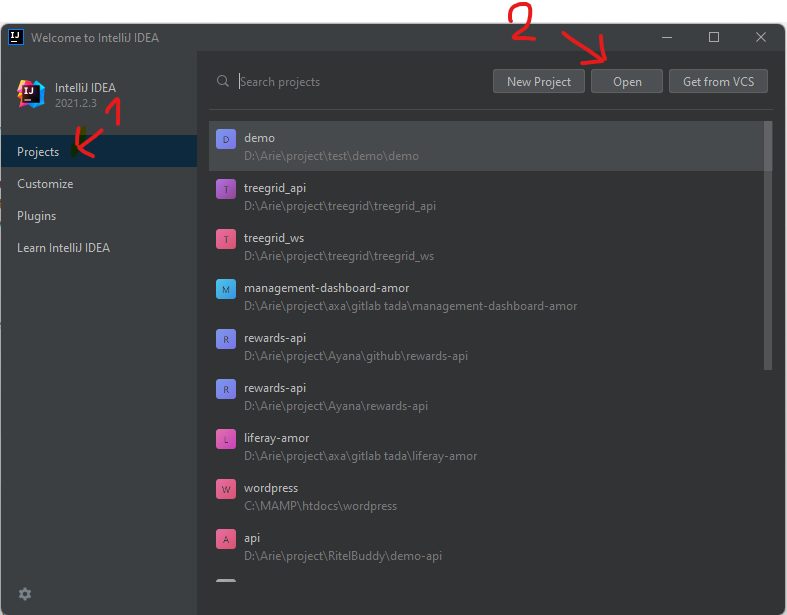
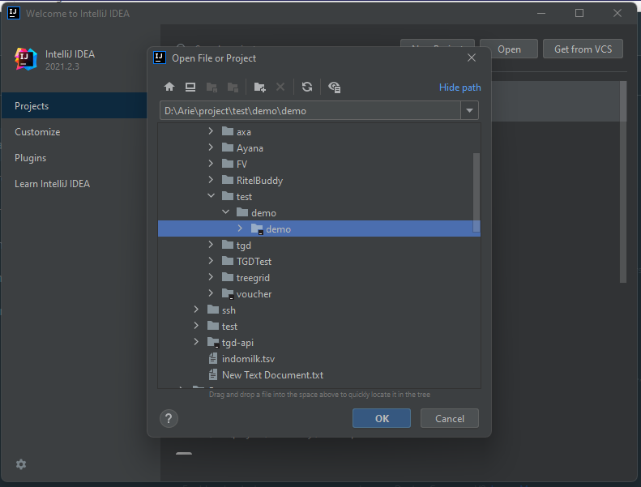
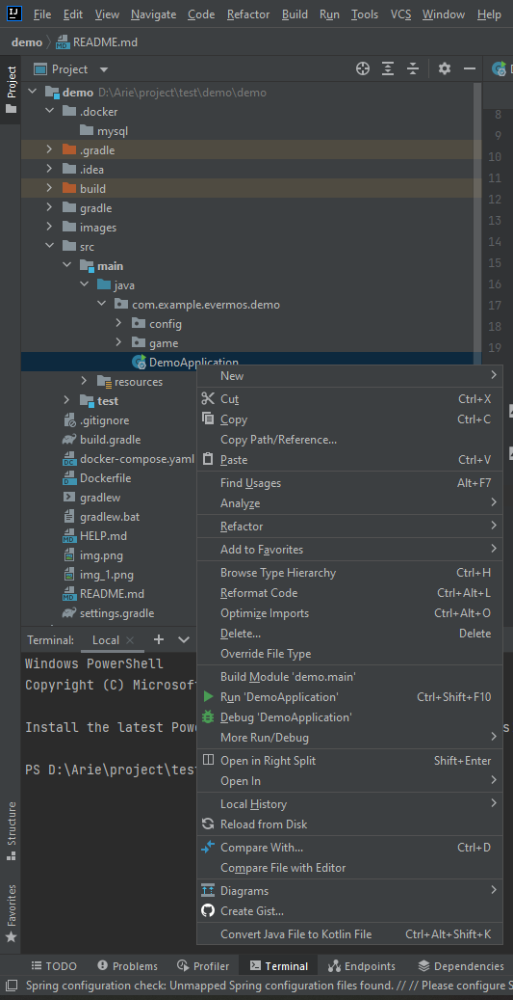

# EVERMOS TECHNICAL TEST
## Jawaban test 1
1. - Tidak adanya validasi stok jika sudah habis pada proses checkout, Sehingga menyebabkan pemesanan yang tidak sesuai dengan stok yang ada.
   - Tidak adanya informasi kalau barangnya sudah habis. diperparah customer sudah checkout, informasi cancel ordernya dikemudian hari.
   - Tidak adanya validasi maksimal qty ketika membeli sebuah produk. Sehingga barang yang dibeli membuat jumlah stok negative.
   
2. - perlunya validasi stok ketika proses checkout demi menghindari order yang tidak sesuai stok atau berlebih.
   - menampilkan informasi jumlah stok yang tersedia/stok masih tersedia atau tidak.
   - menampilkan pesan error jika pesanan tidak dapat diproses karena stok sudah habis/tidak mencukupi

---
##Require
- Docker version 20.10.8
- Java JDK version 11.0.11
---
## Recommended IDEA
- Intellij Idea
---
##Cara menjalankan docker compose
- pastikan docker sudah berjalan
- buka terminal, lalu pilih root directory project
- jalankan
```console
demo@localhost:~$ docker-compose up -d
```
---
##Cara menjalankan app
dengan intellij Idea
- Klik tab project, lalu klik tombol open seperti dibawah ini

- Lalu pilih folder project kamu simpan

- Tunggu sampai build selesai
- Selanjutnya cari file `DemoApplication` dan klik kanan, dan pilih `run 'DemoApplication''`


**_NOTE:_**
sebelum memulai aplikasinya pastikan sudah menjalankan docker ccomposenya

##Cara menjalankan app di docker
- pastikan docker sudah berjalan
- buka terminal, lalu pilih root directory project
- jalankan perintah `.\gradlew clean build -x test`
- setelah selesai, dilanjutkan jalankan perintah `docker build -t evermos/demo:1.0.0 .`
- setelah selesai, buka file `docker-compose.yaml`
- lalu uncomment pada line app sampai bawah
- selanjutnya,  tinggal menjalankan 
```console
demo@localhost:~$ docker-compose up -d
```